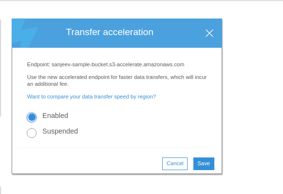

Amazon S3 or __Amazon Simple Storage Service__ is a service offered by Amazon Web Services (AWS) that provides object storage which is built for storing and recovering any amount of information or dât from anywhere over the Internet.

Common use cases for S3:
- Backup and archive for on-premises or cloud data
- Content, media, and software storage and distribution
- Big data analytics
- Static website hosting
- Cloud-native mobile and Internet application hosting
- Disaster recovery

## Storage Classes

Amazon S3 offers storage class to meet your requirement of storing the data about availability, durability ...

Summary detail of each storage class you can found here:

|              | __STANDARD__                                            | __INTELLIGENT_TIRING__                            | __STANDARD_IA__                                                                                                                                                                                | __ONE ZONED-IA__                                                                    | __GLACIER__                                                    | __GLACIER DEEP ARCHIVE__                                                                                                                  |
|--------------|---------------------------------------------------------|---------------------------------------------------|------------------------------------------------------------------------------------------------------------------------------------------------------------------------------------------------|-------------------------------------------------------------------------------------|----------------------------------------------------------------|-------------------------------------------------------------------------------------------------------------------------------------------|
| Purpose      | for general-purpose storage of frequently accessed data | for data with unknown or changing access patterns | optimized for long-lived, but less frequently accessed data, for example, backups and older data where the frequency of access has diminished, but the use case still demands high performance | for long-lived,less frequently accessed data, but requires rapid access when needed | is suitable for archiving data where data access is infrequent | long-term retention and digital preservation for data that may be accessed once or twice in a year, take within 12 hours to retrieve data |
| Availability | 99.99%                                                  | 99.9%                                             | 99.9%                                                                                                                                                                                          | 99.5% in single Availability Zone                                                   | N/A                                                            | N/A                                                                                                                                       |
| Durability   | 99.999999999%  multi Availability Zone                  | 99.999999999% multi Availability Zone             | 99.999999999% multi Availability Zone                                                                                                                                                          | 99.999999999% single Availability Zone                                              | 99.999999999% multi Availability Zone                          | 99.999999999% multi Availability Zone                                                                                                     |

## Object

Amazon S3 is a simple __key-value__ store designed to store as many objects as you want. You store these objects in one or more buckets. An object consists of the following characteristics:
- __Key__ — The name that you assign to an object. You use the object key to retrieve the object.
- __Version ID__ — Within a bucket, a key and version ID uniquely identify an object. Version ID will only available if you turn versioning.
- __Value__ — The content that we are storing
- __Metadata__ — A set of name-value pairs with which you can store information regarding the object.
- __Subresources__ — Amazon S3 uses the subresource mechanism to store object-specific additional information.
- __Access Control Information__ — We can control access to the objects in Amazon S3.

## Bucket

Before we store any data into S3, we first have to create a Bucket. A bucket is similar to how we create a folder on the local system.

- The bucket name must be unique across all of the AWS accounts. It must be at least 3 and no more than 63 characters long.
- Bucket was allocated on the region you specify
- No limit on how much of data that we can store inside a bucket.
- By default, you can create up to 100 buckets in each of your AWS accounts. If you need additional buckets, you can increase your bucket limit by submitting a service limit increase.

### Server logging

- Track request access to S3 bucket.
- Below is the metric of the log.

- Log file will be store in __.TXT__
- Target log bucket must be different with the current bucket but they must be the same region.
- Log metrics can be consumed later by Athena or ELK stack.

### Versioning

- Versioning automatically keeps up with different versions of the same object. For example, say that you have an object (object1) currently stored in a bucket. With default settings, if you upload a new version of object1 to that bucket, object1 will be replaced by the new version. Then, if you realize that you messed up and want the previous version back, you are out of luck unless you have a backup on your local computer. With versioning enabled, the old version is still stored in your bucket, and it has a unique Version ID so that you can still see it, download it, or use it in your applications.

- Turn on versioning will make uploading new object in bucket will return version Id. This version Id will be used to retrieve object. For the object existing previous turn versioning on, version Id will be null.

- Deleting the versioning object only mark deleting the latest version, the old versions still stored.

- Versioning can not be completely disabled, we can only turn enable status to suspend. It mean when you suspend versioning, all old versioning object still keep, when you update new object, new object will given versionIds of null.

- Charge will be calculated by how space all versions of object taking.

### Host static website

- S3 can host static website with domain provided by S3 or you can use your own custom domain.

- Your site will be serve in the same region with S3. You can combine AWS S3 host static vs AWS CloudFront as CDN to distribute your files
- Bucket must provide public-read ACL to serve static website

### Events

- Designed to integrate with other AWS services
- Allow you fire you trigger when you added, updated or removed object in your S3.

- Current supported triggers:
    - __SNS__
    - __SQS__
    - __Lambda__

### Life cycle

A life-cycle configuration is a set of rules that define actions that Amazon S3 applies to a group of objects or to bucket itself to move objects from one storage system to another and finally expiring it. We can define amazon s3 to move data between various storage class on defined schedule.

There are two types of actions:
- __*Transition actions*__: Define when objects transition to another storage class. For example, you might choose to transition objects to the *STANDARD_IA* storage class 30 days after you created them, or archive objects to the *GLACIER* storage class one year after creating them

- __*Expiration actions*__: Define when objects expire. Amazon S3 deletes expired objects on your behalf.

## Transfer acceleration

It enables fast, easy and secure transfer of a file over the long distance between client and S3 bucket.

The edge location around the world provided by Amazon cloud front are taken advantage of transfer acceleration.

It works via carrying data over an optimized network bridge that keep running between CloudFront and S3 location.

We can enable Transfer Acceleration by going into properties of the bucket.

 
