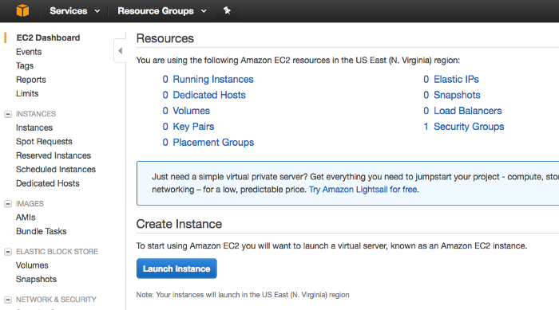
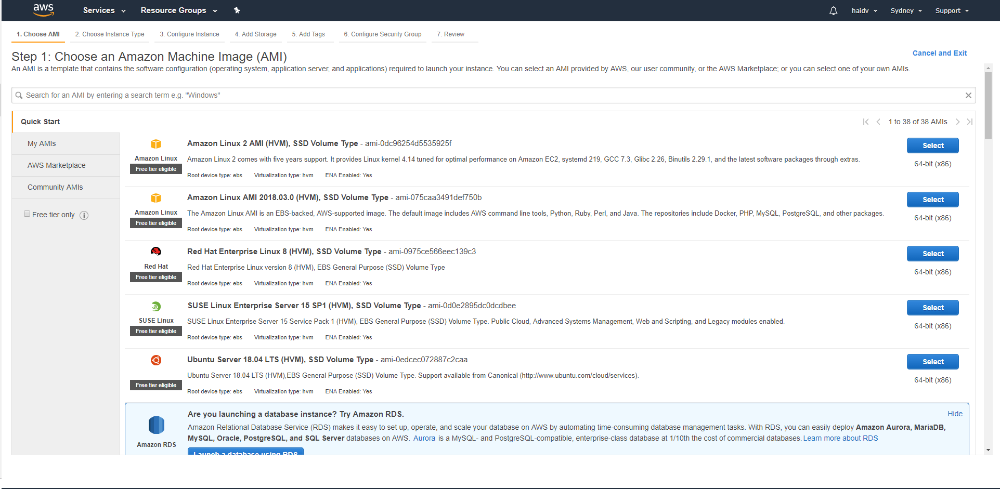
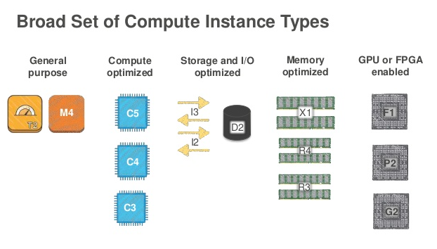
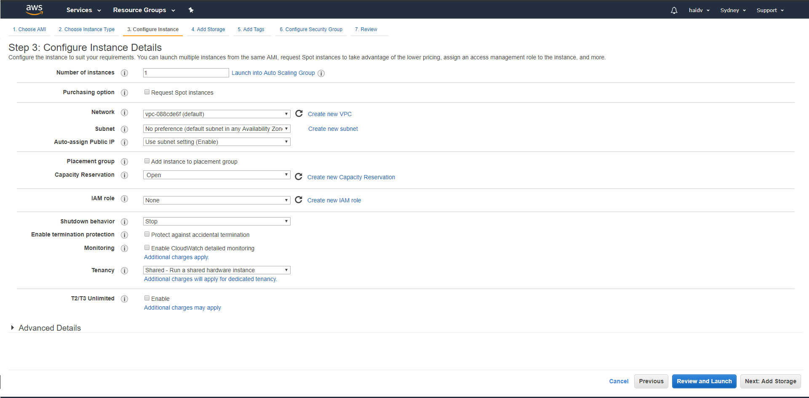
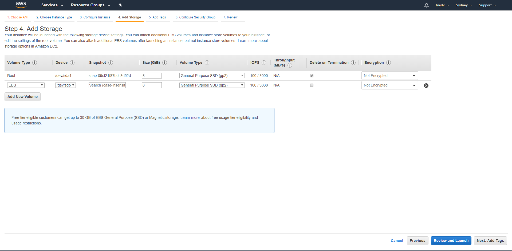
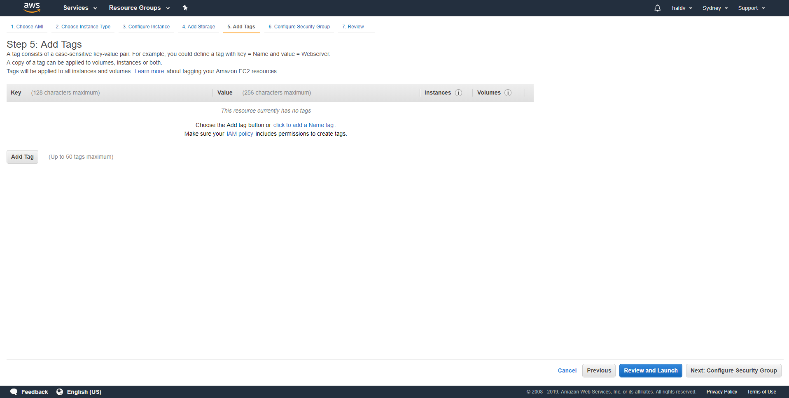
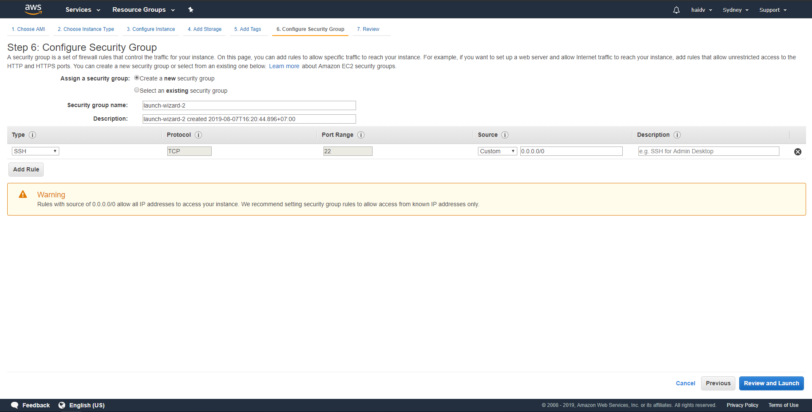

Amazon Elastic Compute Cloud (Amazon EC2) provides scalable computing capacity in the Amazon Web Services (AWS) cloud. Using Amazon EC2 eliminates your need to invest in hardware up front, so you can develop and deploy applications faster. You can use Amazon EC2 to launch as many or as few virtual servers as you need, configure security and networking, and manage storage. Amazon EC2 enables you to scale up or down to handle changes in requirements or spikes in popularity, reducing your need to forecast traffic.

Amazon EC2 provides the following features::
- Virtual computing environments, known as instances
- Preconfigured templates for your instances, known as Amazon Machine Images (AMIs), that package the bits you need for your server (including the operating system and additional software)
- Various configurations of CPU, memory, storage, and networking capacity for your instances, known as instance types
- Secure login information for your instances using key pairs (AWS stores the public key, and you store the private key in a secure place)
- Storage volumes for temporary data that's deleted when you stop or terminate your instance, known as instance store volumes
- Persistent storage volumes for your data using Amazon Elastic Block Store (Amazon EBS), known as Amazon EBS volumes
- Multiple physical locations for your resources, such as instances and Amazon EBS volumes, known as Regions and Availability Zones
- A firewall that enables you to specify the protocols, ports, and source IP ranges that can reach your instances using security groups
- Static IPv4 addresses for dynamic cloud computing, known as Elastic IP addresses
- Metadata, known as tags, that you can create and assign to your Amazon EC2 resources
- Virtual networks you can create that are logically isolated from the rest of the AWS cloud, and that you can optionally connect to your own network, known as virtual private clouds (VPCs)

Let start to create your first EC2 instance

## Creating EC2 instance

### 1. Log into the AWS console. 

Log into the AWS Console then Select EC2 and then __Launch Instance__:

### 2. Chose your Amazon Machine Image (AMI)

An Amazon Machine Image (AMI) is a master image for the creation of virtual servers (known as EC2 instances) in the Amazon Web Services (AWS) environment. You must specify an AMI when you launch an instance

The machine images are like templates that are configured with an operating system and other software, which determine the user’s operating environment. AMI types are categorized according to region, operating system, system architecture (32- or 64-bit), launch permissions and whether they are backed by Amazon EBS or backed by the instance store.

There are many free available AMI on the market, or you can buy them or create your own AMI by snapshot your EBS then publishing it to the market.

### 3. Choose your instance type

Next we’ll have to select the type of EC2 instance we want to boot up. 

There are ten types of EC2 instances:
- Dense Storage (D2)
- Memory Optimized (R4)
- General Purpose (M4)
- Compute Optimized (C4)
- Graphics Intensive (G2)
- High Speed Storage (I2)
- Field Programmable Gateway (F1)
- Lowest Cost General Purpose (T2)
- Graphics General Purpose (P2) and Memory Optimized (X1).

Each type of instance has their purpose. For more information, please look the following picture

### 4. Configure the virtual machine and select a pricing plan

Next we’re going to configure our instance details. There are four different pricing models for EC2 instances:

- __On Demand__: The on-demand pricing model is great for those who want to test out AWS’s EC2 service or are supporting dynamic workloads/applications that have unpredictable and inconsistent resource requirements. With on-demand pricing you pay for the instances you use by the hour and only when you use them
- __Spot__: This pricing method allows organizations to bid the for unused EC2 capacity at a highly discounted rate. While this pricing model is highly attractive from a cost perspective, the pricing and availability of these instances are forever changing based upon usage. Spot instances are best for those workloads that are not time dependent and can afford to be interrupted.
- __Reserved__: Reserved instances are the second most common pricing model in AWS and give organizations the ability to greatly reduce the cost of their AWS environment by making an upfront commitment/payment for those services they know or assume they will need for a given time period.
- __Dedicated Hosts__: With dedicated instances, you receive your own VPC comprised of dedicated, single-tenant hardware. Your instances will be physically isolated at the host level from instances that belong to other AWS accounts. This type is suitable for specific case like your software license is associated with IP computer.

Besides purchasing option, there are some notable configuration
- VPC: define VPC(Virtual Private Cloud) where instance should be located
- Subnet: subnet in your defined VPC. The subnet can be public or private and is tied to specific Availability Zone. This subnet will affect to your instance in network area.
- IAM role: Role for providing additional policies to your instance to access other AWS resources.
- Advanced detail:
    - User script: boostrap script for your instance

### 5. Select storage option

EBS Volume is a virtual hard disk in the cloud. Root means it is where we are going to boot our Operating System from (such as Windows or in our case Linux). With EBS we can create filesystems, run databases and other cool stuff and EBS Volume is persistent.

- There are three different storage types for root EBS volumes:

  - General Purpose SSD (GP2)
  - Provisioned IOPS SSD (IO1)
  - Magnetic HDD.

- Data in EBS Volume can be encrypted by using KMS.
- Delete on Termination means the EBS will be deleted if we delete the EC2 instance by default. However, you can change it to protect your data in EBS after your instance has been terminated.
- You can create a snapshot from EBS then leverage it to create your own AMI. You must stop your instance which is associated with EBS volume you want to create snapshot before creating snapshot.
- You can attach more EBS Volumes even the instance has started.

### 6. Add Tags

Tag is used to label your resource. It 's very useful when you need to find your instance by tag

### 7. Configure Security Group

A security group is a set of firewall rules that control the traffic for your instance. Specifying inbound rule and outbound rule will help secure your instance.

### 8. Review and choose the key

Finally, review your instance and choose the key to connect your instance(through SSH), or you can create a new one

That' all , congratulation, now your instance is running.

