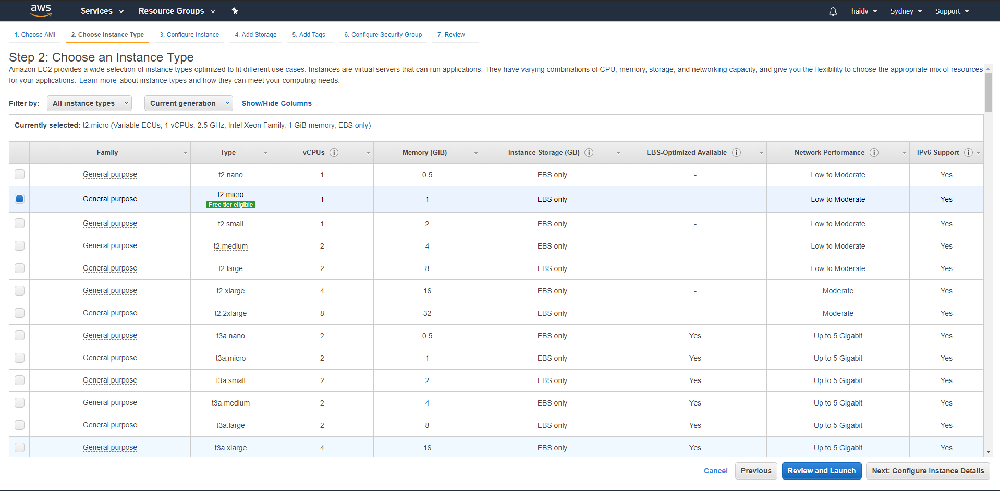
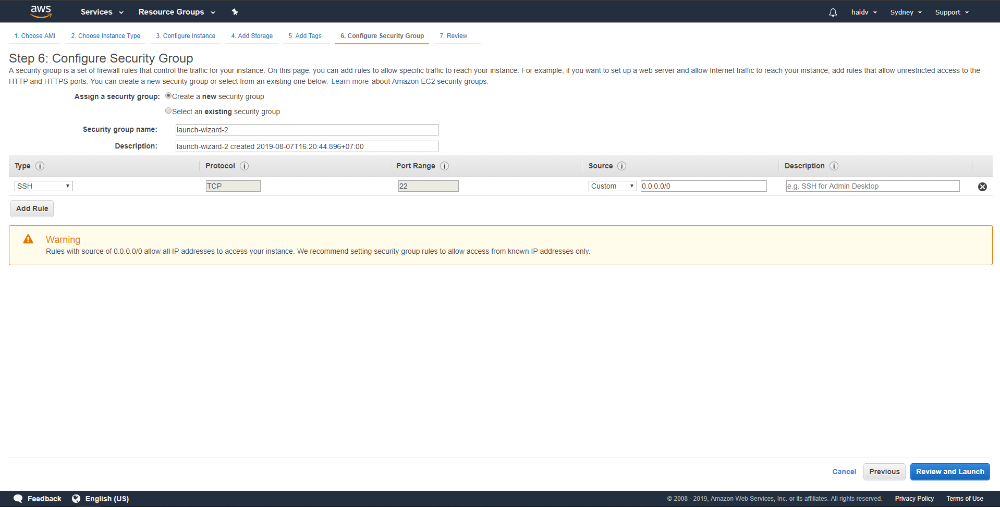

 
Amazon Elastic Compute Cloud (Amazon EC2) provides scalable computing capacity in the Amazon Web Services (AWS) cloud. Using Amazon EC2 eliminates your need to invest in hardware up front, so you can develop and deploy applications faster. You can use Amazon EC2 to launch as many or as few virtual servers as you need, configure security and networking, and manage storage. Amazon EC2 enables you to scale up or down to handle changes in requirements or spikes in popularity, reducing your need to forecast traffic.
 
 
Amazon EC2 provides the following features::
- Virtual computing environments, known as instances
- Preconfigured templates for your instances, known as Amazon Machine Images (AMIs), that package the bits you need for your server (including the operating system and additional software)
- Various configurations of CPU, memory, storage, and networking capacity for your instances, known as instance types
- Secure login information for your instances using key pairs (AWS stores the public key, and you store the private key in a secure place)
- Storage volumes for temporary data that's deleted when you stop or terminate your instance, known as instance store volumes
- Persistent storage volumes for your data using Amazon Elastic Block Store (Amazon EBS), known as Amazon EBS volumes
- Multiple physical locations for your resources, such as instances and Amazon EBS volumes, known as Regions and Availability Zones
- A firewall that enables you to specify the protocols, ports, and source IP ranges that can reach your instances using security groups
- Static IPv4 addresses for dynamic cloud computing, known as Elastic IP addresses
- Metadata, known as tags, that you can create and assign to your Amazon EC2 resources
- Virtual networks you can create that are logically isolated from the rest of the AWS cloud, and that you can optionally connect to your own network, known as virtual private clouds (VPCs)
 
 

## Running EC2 instance

1. Log into the AWS console. Select EC2 and then __Launch Instance__:
 
 

 
 
2. Chose your __AMI__ (Amazon Machine Image)
 

The Amazon Linux AMI, for sake complexity, it 's base image for your instance including dependencies, binary and OS(Linux, CentOS, Window ...). There are some available popular AMI (Amazon Linux 2, Amazon Linux, Redhat, Ubuntu ...) or you can create your own AMI from snapshot.
 
 

 
 
3. Choose your __instance type__
 

Next we’ll have to select the type of EC2 instance we want to boot up. 
 
 
There are ten types of EC2 instances:
- Dense Storage (D2)
- Memory Optimized (R4)
- General Purpose (M4)
- Compute Optimized (C4)
- Graphics Intensive (G2)
- High Speed Storage (I2)
- Field Programmable Gateway (F1)
- Lowest Cost General Purpose (T2)
- Graphics General Purpose (P2) and Memory Optimized (X1).
 
 

 
 

 
 

4. Configure the virtual machine and select a pricing plan
 

Next we’re going to configure our instance details. There are four different pricing models for EC2 instances:
 
- __On Demand__: pay by using hour
- __Spot__: like bidding, but your instance will shutdown any time whenever someone win the bid
- __Reserved__: long-term commiment (3-5 year usage) with lower price than on-demand.
- __Dedicated Hosts__: your instance will be on dedicated host. This type is suitable for specific case like your software license is associated with IP computer.
 
 

 
 

Besides purchasing option, there are some notable configuration
- VPC: define VPC(Virtual Private Cloud) where instance should be located
- Subnet: subnet in your defined VPC. The subnet can be public or private and is tied to specific Availability Zone. This subnet will affect to your instance in network area.
- IAM role: Role for providing additional policies to your instance.
- Other config is quite straightforward.

 

5. Select __storage__ option
 
 
EBS Volume is a virtual hard disk in the cloud. Root means it is where we are going to boot our Operating System from (such as Windows or in our case Linux). With EBS we can create filesystems, run databases and other cool stuff and EBS Volume is persistent.
 

 
 
There are three different storage types for root EBS volumes: General Purpose SSD (GP2), Provisioned IOPS SSD (IO1) and Magnetic HDD. SDD stands for Solid State Drive and HDD is Hard Disk Drive.
 
 
Data in EBS Volume can be encrypted by using KMS.
 
 
Delete on Termination means the EBS will be deleted if we delete the EC2 instance by default.
 
 
You can create a snapshot from EBS then leverage it to create your own AMI.
 
 
You can attach more EBS Volumes after the instance has started.

6. Add __Tags__

Tag is used to label your resource. It 's very useful when you need to find your instance by tag
 
 

 
 

7. Configure __Security Group__

A security group is a set of firewall rules that control the traffic for your instance. Specifying inbound rule and outbound rule will secure your instance.
 
 

 
 

## Configure Auto-Scaling Group
 
 
To be updated
 
 

## Load Balancers
 
 
To be updated
 
 

