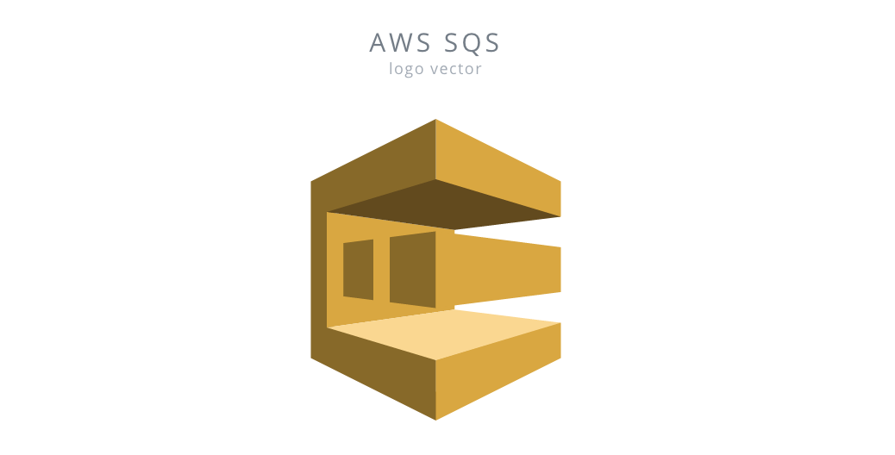
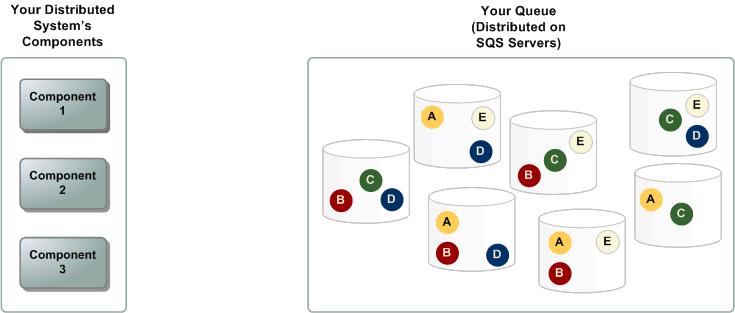
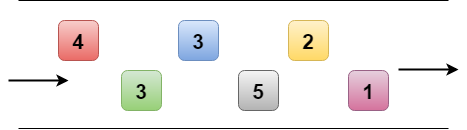
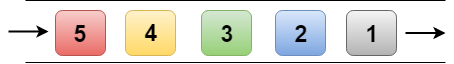
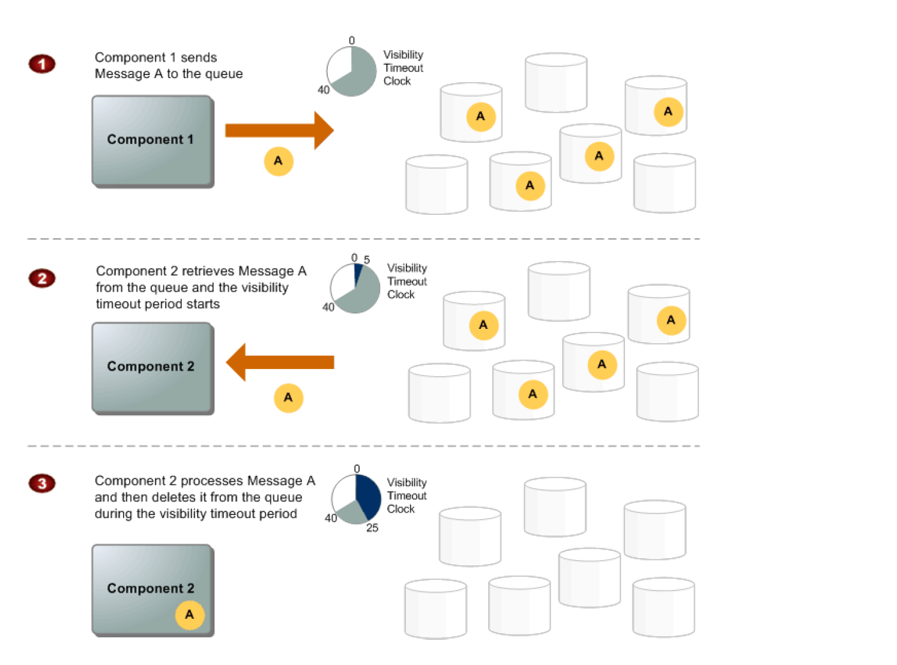

 
Queues are a powerful way of combining software architectures. They allow for asynchronous communication between different systems, and are especially useful when the throughput of the systems is unequal.   
 
Amazon offers their version of queues with Amazon SQS (Simple Queue Service).
 
 
For example, if you have something like:

- System A – produces messages periodically in huge bursts
- System B – consumes messages constantly, at a slower pace

With this architecture, a queue would allow System A to produce messages as fast as it can, and System B to slowly digest the messages at it’s own pace.
 
 
AWS offers a service to support queueing call SQS (Simple Queue Service) with outstanding features:

- _Automatic scaling_ – if your volume grows you never have to give a thought to your queuing architecture. AWS takes care of it under the covers.
- _Infinite scaling_ – while there probably is some sort of theoretical limit here (how many atoms are in the universe?), AWS claims to support any level of traffic.
- _Server side encryption_ – using AWS SSE (Server Side Encryption), messages can remain secure throughout their lifetime on the queues.

## Common use case for SQS

- Work Queues
  - Decouple components of a distributed application that may not all process the same amount of work simultaneously.
- Buffer and Batch Operations
  - Add scalability and reliability to the architecture and smooth out temporary volume spikes without losing messages or increasing latency
- Request Offloading
  - Move slow operations off of interactive request paths by enqueueing the request.
- Fan-out
  - Combine SQS with SNS to send identical copies of a message to multiple queues in parallel for simultaneous processing.
- Auto Scaling
  - SQS queues can be used to determine the load on an application, and combined with Auto Scaling, the EC2 instances can be scaled in or out, depending on the volume of traffic
 
 

## Basic Architecture
 
 

There are three main parts in a distributed messaging system: the components of your distributed system, your queue (distributed on Amazon SQS servers), and the messages in the queue.
 
 

 
 

## Queue Type: Standard vs FIFO

 
 
One important detail that should be mentioned – there are two types of queues within AWS SQS:

- Standard:
  - higher throughput:  unlimited number of transactions per second
  - “at least once delivery”: It guarantees that a message is delivered at least once. However, sometime, more than one copy of a message might be delivered out of order.
  -  “best effort ordering”: ensures that messages are generally delivered in the same order as they are sent but it does not provide a guarantee.
 
 

 
- FIFO (First-In-First-Out)
  - not as high throughput:  300 transactions per second and 3000 messages per second with batching
  - “exactly once processing”: The most important features of a queue are FIFO Queue and exactly-once processing, i.e., a message is delivered once and remains available until consumer processes and deletes it
  - guarantees ordering: i.e., the order in which they are sent is also received in the same order. (based on message group id).
  - prevent duplicated message
 
 

 
 

## Queue and Message Identifiers

- Queue URLs
  - Queue is identified by a unique queue name within the same AWS account
  - SQS assigns each queue with a Queue URL identifier for e.g. http://sqs.us-east-1.amazonaws.com/123456789012/queue2
  - Queue URL is needed to perform any operation on the Queue

- Message ID
  - Message IDs are useful for identifying messages,
  - Each message receives a system-assigned message ID that SQS returns to with the SendMessage response.
  - To delete a message, the message’s receipt handle instead of the message ID is needed
  - Message ID can be of is 100 characters max

- Receipt Handle
  - When a message is received from a queue, a receipt handle is returned with the message which is associated with the act of receiving the message rather then the message itself
  - Receipt handle is required, not the message id, to delete a message or to change the message visibility
  - If a message is received more than once, each time its received, a different receipt handle is assigned and the latest should be used always

- Message Deduplication ID (only available in FIFO Queue)
  - The token used for deduplication of sent messages. If a message with a particular message deduplication ID is sent successfully, any messages sent with the same message deduplication ID are accepted successfully but aren't delivered during the 5-minute deduplication interval.

- Message Group ID (only available in FIFO Queue)
  - The tag that specifies that a message belongs to a specific message group. Messages that belong to the same message group are always processed one by one, in a strict order relative to the message group (however, messages that belong to different message groups might be processed out of order).

## Visibility timeout

- Behaviour
  - SQS does not delete the message once it is received by a consumer,
because the system is distributed, there’s no guarantee that the consumer will actually receive the message (it’s possible the connection could break or the component could fail before receiving the message)
  - Consumer should explicitly delete the message from the Queue once it is received and successfully processed
  - As the message is still available on the Queue, other consumers would be able to receive and process and this needs to be prevented
- SQS handles the above behavior using Visibility timeout.
- SQS blocks the visibility of the message for the Visibility timeout period, which is the time during which SQS prevents other consuming components from receiving and processing that message
- Consumer should delete the message within the Visibility timeout. If the consumer fails to delete the message before the visibility timeout expires, the message is visible again for other consumers.
- Visibility timeout considerations
  - clock starts ticking once SQS returns the message
  - should be large enough to take into account the processing time for each of the message
  - default Visibility timeout for each Queue is 30 seconds and can be changed at the Queue level
  - when receiving messages, a special visibility timeout for the returned messages can be set without changing the overall queue timeout using the receipt handle
  - can be extended by the consumer, if the consumer thinks it won’t be able to process the message within the current visibility timeout period. SQS restarts the timeout period using the new value. The maximum Visibility Timeout is 12 hours.
  - a message’s Visibility timeout extension applies only to that particular receipt of the message and does not affect the timeout for the queue or later receipts of the message
- SQS has an 120,000 limit for the number of inflight messages per queue i.e. message received but not yet deleted and any further messages would receive an error after reaching the limit

## Message Lifecycle
 
 

Below is the diagram describing the message lifecycle in AWS SQS
 

 
 
1. Component 1 sends Message A to a queue, and the message is redundantly distributed across the SQS servers.
2. When Component 2 is ready to process a message, it retrieves messages from the queue, and Message A is returned. While Message A is being processed, it remains in the queue but is not returned to subsequent receive requests for the duration of the visibility timeout.
3. Component 2 deletes Message A from the queue to avoid the message being received and processed again once the visibility timeout expires.
 
 

## Long polling / short polling

- There are 2 ways to retrieve message from queue: long polling vs short polling (default)
- With short polling:
  - SQS samples only a subset of the servers (based on a weighted random distribution) and returns messages from just those servers.
  - A receive request might not return all the messages in the queue. But a subsequent receive request would return the message
- With Long polling,
  - request persists for the time specified and returns as soon as the message is available thereby reducing costs and time the message has to dwell in the queue

## Batching
 
 
SQS allows send, receive and delete batching which helps club up to 10 messages in a single batch while charging price for a single message.
 
 
It helps lower cost and also increases the throughput
 
 

## Pricing

- The first 1 million monthly requests are free.
- After that, the pricing is as follows for all regions:  Standard Queue: $0.40 ($0.00000040 per 1M request); FIFO Queue: $0.50 ($0.00000050 per 1M request)

## Other note

- SQS is pull-based, not push-based
- Messages are 256 KB in size. If message size is larger more than this limit, you can leverage S3 or DynamoDB to store message content and in the message, just point to S3 store your message
- Messages are kept in a queue from 1 minute to 14 days.
- The default retention period is 4 days.

## References 

- Dissecting SQS FIFO Queues — Does Ordered and Exactly Once Messaging Really Exist: _https://sookocheff.com/post/messaging/dissecting-sqs-fifo-queues/_
- Simple Queue Service – SQS: _http://jayendrapatil.com/aws-sqs-simple-queue-service/_
- A Node.js introduction to Amazon Simple Queue Service (SQS): _https://medium.com/@drwtech/a-node-js-introduction-to-amazon-simple-queue-service-sqs-9c0edf866eca_
- Deduplicating Amazon SQS Messages: _https://medium.com/swlh/deduplicating-amazon-sqs-messages-dc114d1e6545_
- Amazon Simple Queue Service: _https://docs.aws.amazon.com/AWSSimpleQueueService/latest/SQSDeveloperGuide/welcome.html_