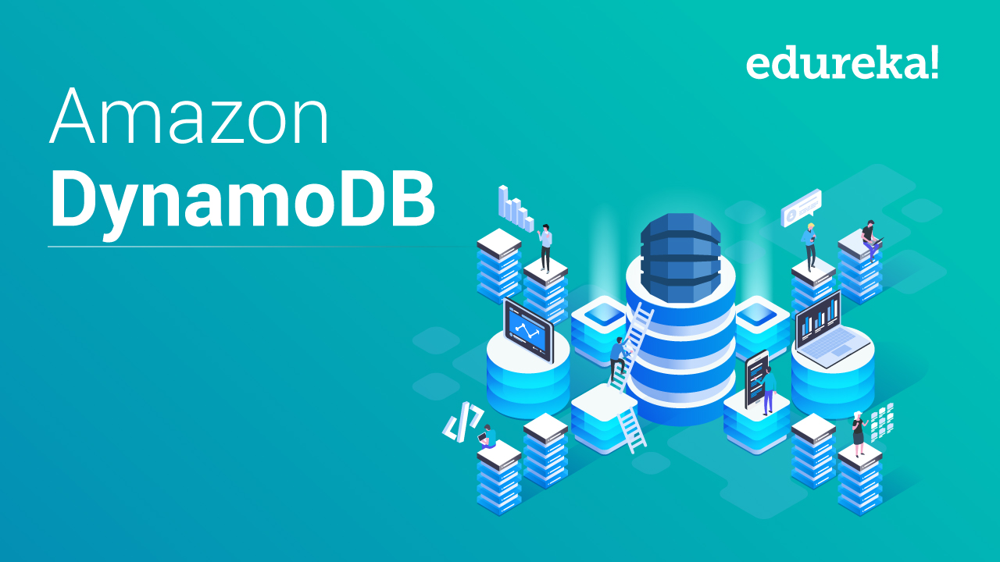

<br>
DynamoDB is a managed NoSQL database provided by AWS, and it is a highly scalable and reliable database.
<br>
<br>
Common use cases for DynamoDB:
- Storage flexible structured data
- Handle large volume of data
- Streaming data

### Table
<br>
<br>

DynamoDB organises data as tables and each table contains several items (rows) and each item has __Keys__ and __Attributes__ (columns).
<br>
<br>
The tables in the DynamoDB are non relational and non schema based.
<br>
<br>
When we create the table, beside specifying table name, we need specify primary key, we can’t change these later but rest of the attributes (columns) of item (row) can change. DynamoDB supported two type of primary key

  - __Hash Primary Key__: need only one attribute to create primary key. DynamoDB build hash index __without order__ for primary key.
  - __Hash và Range Primary Key__: need two attributes to create primary key, one is __hash attribute__ and the other is __range attribute__. DynamoDB build hash index __without order__ for hash attributes and range index __with order__ for range attribute. This is allowed the case two item has the same hash attribute but different range attribute exists in the same table

You can also determine your throughput for you table through 2 metrics

  - __Read capacity unit__: determine the volume of data will read in strong consistency mode. Each unit will be 4Kb. For example, you need to read 16kb average per second, you read capacity unit should be 4.
  - __Write capacity unit__: determine the number of write for table. Each write will be has 1kb.

There are two read mode in DynamoDB
 - __Strongly consistent__: it gurantees that  your data is always latest.
 - __Eventually consistent__: it gurantees that your data will be replicate in all partion but the data is not the latest at the particular time.


### Item
<br>
<br>

A DynamoDB item is nothing but a row in the table.
<br>
<br>
We can change any attribute of an item except its keys, these keys are an identification for an item; if we have to change these keys, then the only option is to delete an item and create it again.
<br>
<br>


### Data Types
<br>
<br>

DynamoDB supports different data types for attributes of an item, they can be mainly categorised into the following:
- Scalar Types : Number, String, Binary, Boolean and Null.
- Document Types : List and Map
- Set Types : Number Set, String Set, and Binary Set.

### Query
<br>
<br>
To query table we must pass primary key so selecting proper primary key for the table is important. Query operation will return all items that are matched with primary key of the table.
<br>
<br>

__Note__: condition could not be used with primary key
<br>
<br>
Range key is optional and can combine with supported conditional

```
a = b — true if the attribute a is equal to the value b
a < b — true if a is less than b
a <= b — true if a is less than or equal to b
a > b — true if a is greater than b
a >= b — true if a is greater than or equal to b
a BETWEEN b AND c — true if a is greater than or equal to b, and less than or equal to c
```
Maximum response will be 1 MB
<br>
<br>
Query supported both strongly consistent and eventually consistent
<br>
<br>
All return item will be caculated as one query operation. For e.g: 100 1KB item => 100 x 1KB / 4KB = 25 reads
<br>
<br>
### Scan
<br>
<br>
Scan operation doesn’t require primary key to fetch results from the table. As the name suggests, it scans an entire table to filter results based on attribute values passed as filters.
<br>
<br>
Scan can be used in both table and secondary index
<br>
<br>
Maximum response will be 1 MB
<br>
<br>

__Note__:

- Do not scan the big table
- Bigger and bigger your table is, the greater and grater response time is


### Pagination
<br>
<br>
DynamoDB Query/Scan results return maximum of 1MB response size so if our request matches an items of size more than 1MB, it gets automatically divided into pages. 
<br>
<br>
In such cases DynamoDB returns a special response parameter “LastEvaluatedKey” and this can be used to fetch next page results. Please note we need to pass the value of “LastEvaluatedKey” as “ExclusiveStartKey” in the next request to DynamoDB.
<br>
<br>
In some cases we might want to fix page size to number such as 10 or 20 results per page. In those cases we can use the “Limit” parameter. Please note if the results matching to the “Limit” is more than 1MB then DynamoDB only returns subset of the results which fits to 1MB limit.
<br>
<br>

### Sorting
<br>
<br>
When we use Query/Scan operation on a DynamoDB table, then by default the results are sorted based on Sort Key value of the table. Incase we want that results in reverse order then we need to pass “ScanIndexForward” as “false” in query/scan request parameters. 
<br>
<br>
If the data type of Sort key is a number, then the results will be in a numeric order, otherwise, results will be in UTF-8 bytes. By default sort order is ascending. To get results in a descending order, pass “ScanIndexForward” as “false”.
