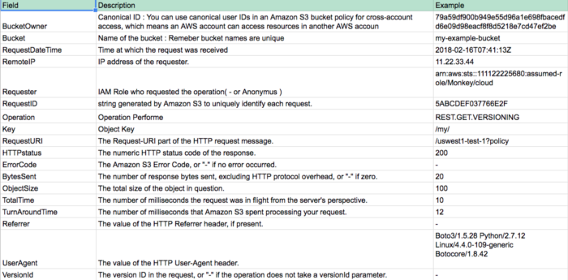

 
Amazon S3 or Amazon Simple Storage Service is a service offered by Amazon Web Services (AWS) that provides object storage through a web service interface. Amazon S3 uses the same scalable storage infrastructure that Amazon.com uses to run its global e-commerce network
 
 
 
## TL&DR
- S3 is cloud storage service in AWS. It will store your file in key-value.
- S3 Storage Classes
  - S3 Standard: for general-purpose storage of frequently accessed data. Availability: 99.99%, durability: 99.999999999%  multi Availability Zone
  - S3 Intelligent-Tiring: for data with unknown or changing access patterns. Availability: 99.9%, durability: 99.999999999% multi Availability Zone
  - S3 Standard-IA: for long-lived, but less frequently accessed data,
  Availability: 99.9%, durability: 99.999999999% multi Availability Zone
  - S3 One Zone -IA: for long-lived, but less frequently accessed data,
  Availability: 99.5% in single Availability Zone, durability: 99.999999999% single Availability Zone
  - S3 Glacier: a secure, durable, and low-cost storage class for data archiving. durability: 99.999999999% multi Availability Zone, take some minutes to hours to retrieve data
  - S3 Glacier Deep Archive: long-term retention and digital preservation for data that may be accessed once or twice in a year. durability: 99.999999999% multi Availability Zone, take within 12 hours to retrieve data
- Most useful features: server logging, versioning, host static website, transfer acceleration, events, life cycle
- S3 is quite cheap

## Terms
- Bucket: name of S3 bucket will store your files
- Key: the key for your file in S3 bucket. Key will be used to manipulate file in S3

### Server logging

- Track request access to S3 bucket.
- Below is the metric of the log.
 

- Log file will be store in __.TXT__
- Target log bucket must be different with the current bucket but they must be the same region.
- Log metrics can be consumed later by Athena or ELK stack.

### Versioning

- Versioning automatically keeps up with different versions of the same object. For example, say that you have an object (object1) currently stored in a bucket. With default settings, if you upload a new version of object1 to that bucket, object1 will be replaced by the new version. Then, if you realize that you messed up and want the previous version back, you are out of luck unless you have a backup on your local computer. With versioning enabled, the old version is still stored in your bucket, and it has a unique Version ID so that you can still see it, download it, or use it in your applications.

- Turn on versioning will make uploading new object in bucket will return version Id. This version Id will be used to retrieve object. For the object existing previous turn versioning on, version Id will be null.

- Deleting the versioning object only mark deleting the latest version, the old versions still stored.

- Versioning can not be completely disabled, we can only turn enable status to suspend. It mean when you suspend versioning, all old versioning object still keep, when you update new object, new object will given versionIds of null.

- Charge will be calculated by how space all versions of object taking.

### Host static website

- S3 can host static website with domain provided by S3 or you can use your own custom domain.
- Specify the index page and error page. That's all :)
- Bucket must provide public-read ACL to serve static website

### Events

- S3 has a collection of events like create, update, delete object and more.
- You can create a hook which will be trigger by associated event.
- Current supported triggers:
    - SNS
    - SQS
    - Lambda

### Life cycle

A lifecycle configuration is a set of rules that define actions that Amazon S3 applies to a group of objects. There are two types of actions:

- Transition actions—Define when objects transition to another storage class. For example, you might choose to transition objects to the STANDARD_IA storage class 30 days after you created them, or archive objects to the GLACIER storage class one year after creating them

- Expiration actions—Define when objects expire. Amazon S3 deletes expired objects on your behalf.

 
